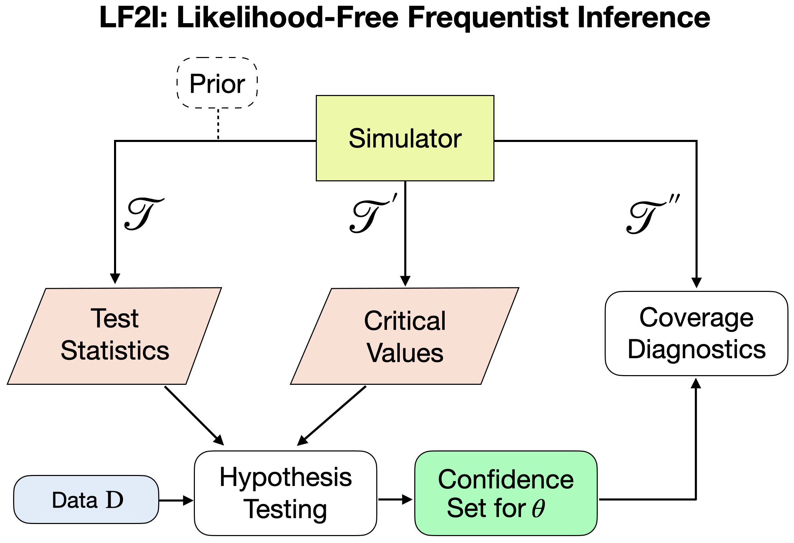

.. LF2I documentation master file

LF2I: Likelihood-Free Frequentist Inference
============================================

.. image:: https://img.shields.io/pypi/v/lf2i
   :target: https://pypi.org/project/lf2i/
   :alt: PyPI

.. image:: https://img.shields.io/github/license/lee-group-cmu/lf2i
   :target: https://github.com/lee-group-cmu/lf2i/blob/main/LICENSE.txt
   :alt: License

Getting Started
----------------

What is LF2I?
~~~~~~~~~~~~~

``lf2i`` is a Python package for likelihood-free inference; that is, inference
on the parameters :math:`\boldsymbol{\theta}` of a statistical model
:math:`F_{\boldsymbol{\theta}}` in a setting where the likelihood
:math:`\mathcal{L}(\boldsymbol{\theta}; \mathcal{D}) := p(\mathcal{D} \mid \boldsymbol{\theta})`
cannot be evaluated but is *implicitly* encoded by a high-fidelity simulator for
:math:`F_{\boldsymbol{\theta}}`. In other words, one can simulate data in
batches of size :math:`n`, :math:`\mathcal{D} = (X_1, \dots, X_n)`, for any
given :math:`\boldsymbol{\theta}` in the parameter space.

What does LF2I do?
~~~~~~~~~~~~~~~~~~~

``lf2i`` constructs confidence regions for parameters of interest with correct
*coverage* across the whole parameter space, that is, sets
:math:`\mathcal{R}(\mathcal{D})` satisfying
:math:`\mathbb{P}(\boldsymbol{\theta} \in \mathcal{R}(\mathcal{D})) = 1 - \alpha \; \; \forall \theta \in \Theta`,
where :math:`(1 - \alpha) \in (0, 1)` is a prespecified confidence level.
Coverage is guaranteed regardless of

#. the prior distribution over the parameters of interest;
#. the true value of the parameters of interest: the coverage guarantee holds
   point-wise over the parameter space (i.e., not only on average); and
#. the size of the observed sample: the coverage guarantee holds even for
   finite sample sizes, including for the case of one observation, i.e.
   :math:`n = 1`.

Structure of LF2I
~~~~~~~~~~~~~~~~~~

``lf2i`` is based on the equivalence of confidence sets and hypothesis tests.
It leverages supervised machine learning methods to efficiently execute the
Neyman construction of confidence sets. The framework has three separate
modules for estimating

#. test statistics (such as `ACORE <https://arxiv.org/pdf/2002.10399.pdf>`_,
   `BFF <https://arxiv.org/abs/2107.03920>`_,
   `Waldo <https://arxiv.org/abs/2205.15680>`_, etc.);
#. critical values for a level :math:`\alpha` test; and
#. empirical coverage

across the entire parameter space. See the figure below for a schematic
diagram.

While steps 1 and 2 are used to construct the confidence sets, step 3 is an
independent diagnostic tool that can be used to check whether a given
parameter region (such as ``lf2i`` confidence sets, posterior credible
regions, prediction sets, etc.) has the right conditional coverage. Because
``lf2i`` is modular, users can construct valid confidence sets using any test
statistic of their choice.

Usage
~~~~~

``lf2i`` offers a simple interface that allows you to get started quickly.
The entry point is the :class:`~lf2i.inference.lf2i.LF2I` class in the
:mod:`lf2i.inference` module, which wraps the different functionalities. The
method ``inference`` merges steps 1 and 2 to return confidence sets with
correct coverage. The method ``diagnostics`` performs step 3 as an
independent check of the empirical coverage of the constructed parameter
regions.

.. code-block:: python

   from lf2i.inference import LF2I

   inference = LF2I(test_statistic=..., prior=...)
   confidence_sets = inference.inference(...)  # Steps 1 and 2
   diagnostics = inference.diagnostics(...)  # Step 3

See :doc:`tutorials` for worked examples, and :doc:`api/lf2i` for the full
API reference.

Install
-------

``lf2i`` is available on PyPI at `this link <https://pypi.org/project/lf2i/>`_.
It can be installed using ``pip``:

.. code-block:: bash

   pip install lf2i

The diagnostics module leverages smoothing splines implemented in ``R``,
which is assumed to be installed along with the ``mgcv`` package.

Feedback and Contributions
---------------------------

We strongly encourage users to leave feedback and report bugs either by
using the *Issues* tab on `GitHub <https://github.com/lee-group-cmu/lf2i>`_,
or by contacting us directly. The current maintainer(s) can be reached
`here <mailto:jamescarzon98@gmail.com>`_.

If you want to contribute, feel free to open an issue and/or a pull request.

References
----------

LF2I is based on the following research articles:

- `Confidence sets and hypothesis testing in a likelihood-free inference setting (ICML 2020) <http://proceedings.mlr.press/v119/dalmasso20a/dalmasso20a.pdf>`_
- `Simulation-Based Inference with Waldo: Confidence Regions by Leveraging Prediction Algorithms and Posterior Estimators for Inverse Problems (AISTATS 2023) <https://arxiv.org/pdf/2205.15680.pdf>`_
- `Likelihood-free frequentist inference: bridging classical statistics and machine learning for reliable simulator-based inference (Electron. J. Statist., 2025) <https://doi.org/10.1214/24-EJS2307>`_
- `Trustworthy scientific inference with generative models (Mach. Learn.: Sci. Technol., 2026) <https://doi.org/10.1088/2632-2153/ae67cd>`_

.. toctree::
   :maxdepth: 2
   :caption: Contents:
   :hidden:

   tutorials
   api/lf2i
